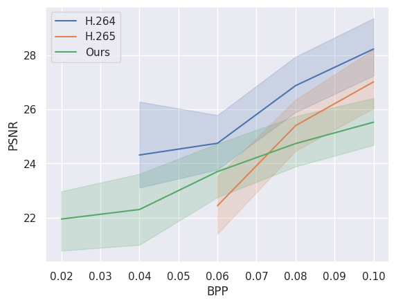
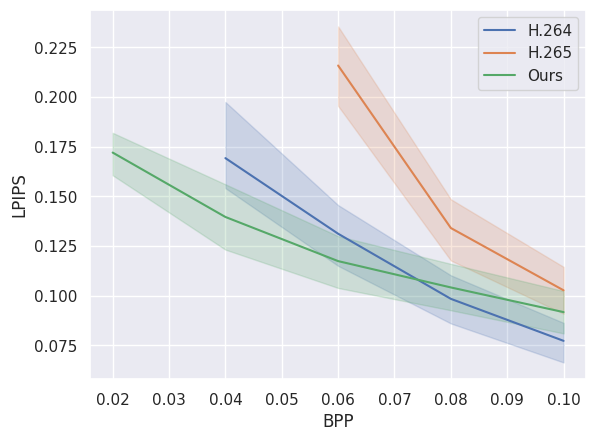

# Extreme Video Compression With Prediction Using Pre-trainded Diffusion Models 
## Usage


### Prerequisites
Python 3.8 and conda, get [Conda](https://www.anaconda.com/)
CUDA if want to use GPU
Environment

```
conda create -n $YOUR_PY38_ENV_NAME python=3.8
conda activate $YOUR_PY38_ENV_NAME
pip install -r requirements.txt
```


### Compress
For our project, the input is in the form of an array with a shape of (B, T,  C, H, W), where each frame in the array has a fixed size of 128x128. The number of frames in each video is 30, resulting in a shape of (B, 30, 3,128, 128). Before using this project, you may need to preprocess your video data accordingly.In the code, we provide an example array "city_bonn.npy" with a shape of (46, 30, 3, 128, 128). This array contains 46 videos from the city of Bonn in the Cityscape dataset. Below is an example command.

You can control which videos to process by choosing the values for start_idx and end_idx. Ensure that the selected range does not exceed the value of B (the number of videos in your dataset).
```
python city_sender.py --data_npy "city_bonn.npy" --output_path "your path" --start_idx 0 --end_dix 1 
```
### Benchmark
In the Benchmark section, we provide code for computing compression metrics for H.264 and H.265. The input for this code should be 30 frames of 128x128 image frames, preferably named in the format "frame%d."

the folder structure of dataset is like

```
/your path/
 - frame0.png
- frame1.png
 - ...
 - frame29.png
```


For project_str, this is simply a string used to distinguish your data.

```
python bench_uvg.py --dataset "your path" --outpath "your path" --project_srt uvg
```
## Checkpoint

Regarding the checkpoints, we utilize two sets of them. One set includes "checkpoint_900000.pt," which is used for the video generation part. The other set contains six groups of checkpoints, and these checkpoints will be used for the image compression part, corresponding to six different compression qualities.

### checkpoints of image compression models

The six weights need to be moved to the "NN_CheckPoint" folder.

| lambda | quality | 
| ------- | ------- | 
| 0.45  | [q5](https://drive.google.com/file/d/1_RCV0oVKOac543XGrpocnBNUJvtjPDTB/view?usp=drive_link)  | 
| 0.15  | [q4](https://drive.google.com/file/d/1BA8JxfWSCXBYZsGS2GTsdPDbPS-UXeUH/view?usp=drive_link) | 
|0.032  |[q3](https://drive.google.com/file/d/1nyYvHlEivNW_PXAN3wPfIRPXz8oBs_Ff/view?usp=drive_link)  | 
| 0.015  |[q2](https://drive.google.com/file/d/1Cja3YInI7XU0iJZm0tVtGbau1OWlAaJW/view?usp=drive_link) | 
|0.008 | [q1](https://drive.google.com/file/d/1A7f4beJEd-fMj0pwZ0ayswq_j2FoDxD4/view?usp=drive_link) | 
| 0.004 | [q0](https://drive.google.com/file/d/1TVursXwljO0V-wQUm7i8yNqDVKfen51S/view?usp=drive_link) | 

### checkpoints of video generation models

This individual weight needs to be moved to the "checkpoints/sender" folder.

 |checkpoints of diffusion model | 
| ------- | 
 | [link](https://drive.google.com/file/d/1rezZ0kwPfAk-WPgD_0vwO6zCwjOhm6Dk/view)  | 


### Model performance chart



